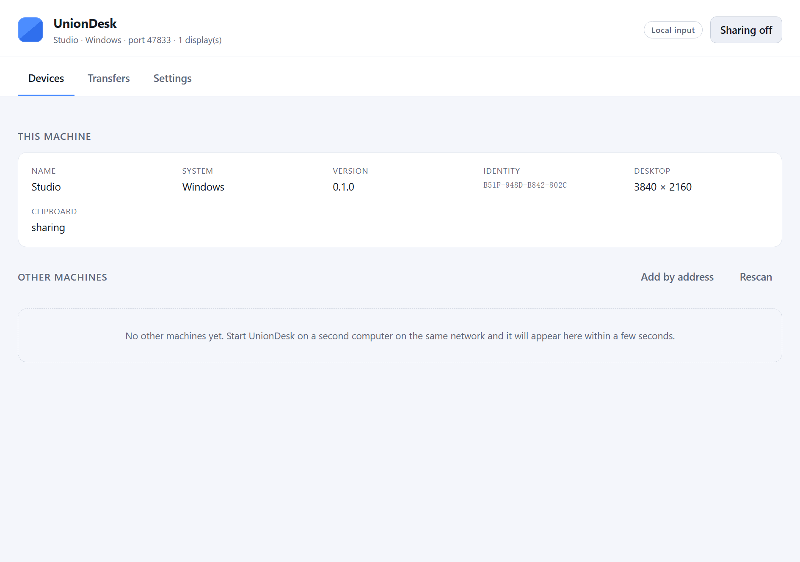

# UnionDesk

[](https://github.com/ruiqiangzh/uniondesk/actions/workflows/ci.yml)
[](LICENSE)

Use one keyboard, mouse and clipboard across the computers on your local network,
and move files between them. Windows and macOS, built with Rust and Tauri.

Everything runs on your LAN. There is no account, no server and no cloud; peers
talk directly to each other over an encrypted channel.



## What it does

**Keyboard and mouse sharing.** Point the cursor at a screen edge and the machine
on the other side of that edge takes over, with the pointer, buttons, wheel and
keys flowing across. Point back through the edge and control returns home.

**Clipboard sync.** Text and images copied on one machine appear on the others.
A content hash is compared on both ends, so a payload that was just applied is
never echoed back to where it came from.

**File transfer.** Drag files onto the window, or pick them from a device card.
Progress is shown per transfer, directories are rebuilt on the far side, and
received path names are validated so a peer cannot write outside the download
folder.

## Status

Honest summary of what has and has not been exercised.

| Area | State |
| --- | --- |
| Build, unit tests, integration tests on Windows | Passing (`cargo test --workspace`) |
| Encrypted session + pairing | Covered by an end to end test that starts two engines and pairs them |
| Desktop app launches and renders | Verified on Windows |
| Windows input backend | Starts, and reports the real desktop geometry; the handover itself still needs a two machine smoke test |
| macOS input capture and injection | Implemented and type checked, **not run** |
| Clipboard text and images | Implemented |
| Clipboard file lists | Not implemented (drag and drop covers the same need) |

The keyboard and mouse handover in particular is the kind of thing that only
settles down after real use on real hardware: pointer acceleration, mixed DPI
setups and keyboard layouts all need a pass on two machines side by side.

## Building

Prerequisites: a recent stable Rust toolchain, and on Windows the MSVC build
tools plus WebView2 (present on Windows 10 and later).

```sh
cargo build --release -p uniondesk
```

The executable lands in `target/release/uniondesk` (`uniondesk.exe` on Windows).
Icons are generated from source so no graphics toolchain is needed:

```sh
node tools/make-icons.mjs     # regenerate apps/desktop/src-tauri/icons
```

The frontend is plain HTML, CSS and JavaScript with no build step, so the whole
application builds with Cargo alone.

### macOS notes

macOS will not let any application move the pointer or read the keyboard until
you grant it, under **System Settings → Privacy & Security**:

- **Accessibility** — required to post synthetic events.
- **Input Monitoring** — required to observe the real keyboard and mouse.

UnionDesk prompts for Input Monitoring the first time sharing is switched on, and
the app shows the same reminder in the Devices tab. macOS delivers no error when
a tap is created without permission, so the app checks before it tries.

For distribution you will also want to sign and notarise the bundle; the
`bundle.macOS` section of `tauri.conf.json` is where those settings go.

## Using it

1. Start UnionDesk on both machines. They find each other over multicast DNS,
   with a UDP broadcast beacon as a fallback for networks that filter multicast.
2. Turn on **Sharing** on both machines.
3. Pair. One machine shows a six digit code and the other asks for it. Comparing
   codes proves the two machines are talking directly to each other and not to
   something in the middle.
4. Pick a screen edge for the machine on each device card, then move the pointer
   across it.

The panic shortcut, **Scroll Lock twice**, releases control immediately. It is
configurable in Settings, and it is only ever armed while UnionDesk is actually
relaying input.

## Design

### Crates

| Crate | Responsibility |
| --- | --- |
| `ud-core` | Domain types: geometry, screen layout maths, input events, protocol messages, configuration, identity |
| `ud-net` | Peer discovery (mDNS + broadcast beacon) and the encrypted session: a Noise `XX` handshake wrapped around TCP |
| `ud-input` | Platform input backends: capture and injection, one module per operating system |
| `ud-clipboard` | Clipboard polling, change detection and PNG handling |
| `ud-engine` | The actor that ties everything together and drives the user interface |
| `apps/desktop` | Tauri application: window, tray, commands and the web interface |

### The engine is an actor

One Tokio task owns all mutable state. The UI, the network, the input backend,
the clipboard watcher and the discovery services all talk to it through a single
event channel, and it answers by publishing a complete snapshot. Nothing is
behind a shared lock, so the interface can never observe half-applied state, and
a slow consumer cannot corrupt anything by holding a lock too long.

### Security

Every connection is a Noise `XX` handshake, which authenticates both sides with
static X25519 keys and encrypts everything that follows with ChaCha20-Poly1305.
The handshake uses `XX` rather than a pattern that requires knowing the peer in
advance, because pairing *is* the moment two devices meet for the first time.

Peer public keys are pinned on first pairing. A device that presents a different
key under a known identity is refused outright — a stolen pairing cannot be
silently replaced. The six digit code is checked inside the encrypted channel,
which is what makes an active attacker on the path detectable.

Input events share one connection with bulk traffic but travel on a separate
queue that is always written first, so a large file transfer cannot make the
pointer stutter.

### Why the input path is intrusive only when it has to be

UnionDesk is passive until the cursor actually reaches a configured edge. While
passive it polls the cursor position and installs no hooks at all. Hooks appear
only for the duration of a handover, and are removed the moment control returns.
That matters: a crash or a bug can never leave someone with a keyboard that types
into the void.

On Windows the hooks swallow input while a low level raw input stream supplies
the true device deltas, because a swallowed move still reports a cursor position
through the hook and would drift. On macOS a `CGEventTap` at the HID level
deletes events outright. Both backends tag everything they synthesise so their
own hooks ignore it.

### Screen layout

Each machine reports the bounding box of its displays. `ud-core::layout` places
those boxes next to each other according to the configured edge links and
converts a cursor position on one machine into the matching position on the
other, in both directions. The maths is covered by unit tests, including peers
whose own coordinate space has a negative origin, which is what a display
arranged to the left of the primary one reports.

## Testing

```sh
cargo test --workspace
```

The integration test in `crates/ud-engine/tests/pairing.rs` starts two complete
engines in temporary directories, dials one from the other over loopback, walks
the pairing handshake and asserts that both sides end up connected with a usable
screen edge.

To type check the macOS backend without a Mac:

```sh
cargo check -p ud-input --features parse-check-macos
```

`cargo check` never links, so the CoreGraphics symbols stay unresolved while
every type and name in the macOS backend is still verified.

## Automatic builds

Two GitHub Actions workflows are included.

**`.github/workflows/ci.yml`** runs on every push to `main` and on pull
requests: tests on Windows and macOS, the macOS backend type check, a release
build, and an advisory lint pass.

**`.github/workflows/release.yml`** builds installers and attaches them to a
draft release. Push a tag to trigger it:

```sh
git tag v0.1.0
git push origin v0.1.0
```

It produces an `.msi` and an NSIS `.exe` for Windows, and a `.dmg` for macOS on
both Apple silicon and Intel. The bundles are unsigned, so Gatekeeper will warn
on first launch; the workflow has a commented block showing which repository
secrets to add once you have an Apple Developer certificate.

## Configuration

Settings, the device identity, the list of paired machines and the log file live
in the platform configuration directory:

- Windows: `%APPDATA%\UnionDesk`
- macOS: `~/Library/Application Support/UnionDesk`

`uniondesk.log` is the first place to look when something misbehaves: a tray
application has no console, so nothing else survives. UnionDesk's own crates
always record at info level there, while `RUST_LOG` still controls everything
else.

Set `UNIONDESK_CONFIG_DIR` to point somewhere else, which is handy for running
two instances on one machine.

## Contributing

The most useful thing anyone can do right now is run it between two real
machines and report where the pointer feel or the handover timing is off. That
feedback is what the tuning constants in `ud-core::config` are waiting for.

## Licence

MIT. See [LICENSE](LICENSE).
